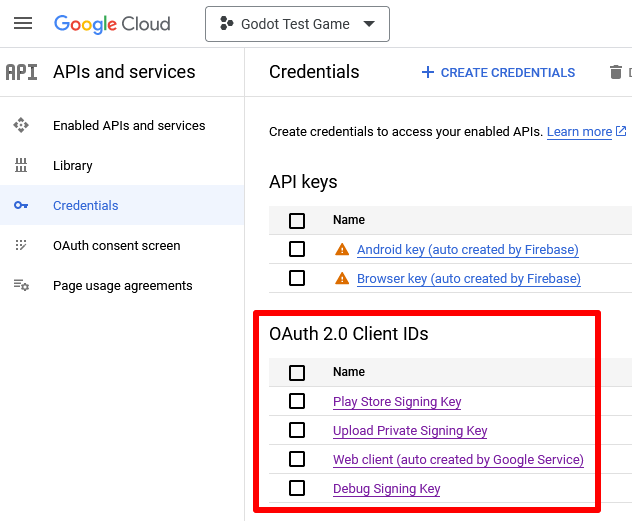
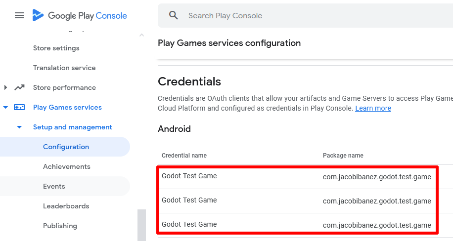
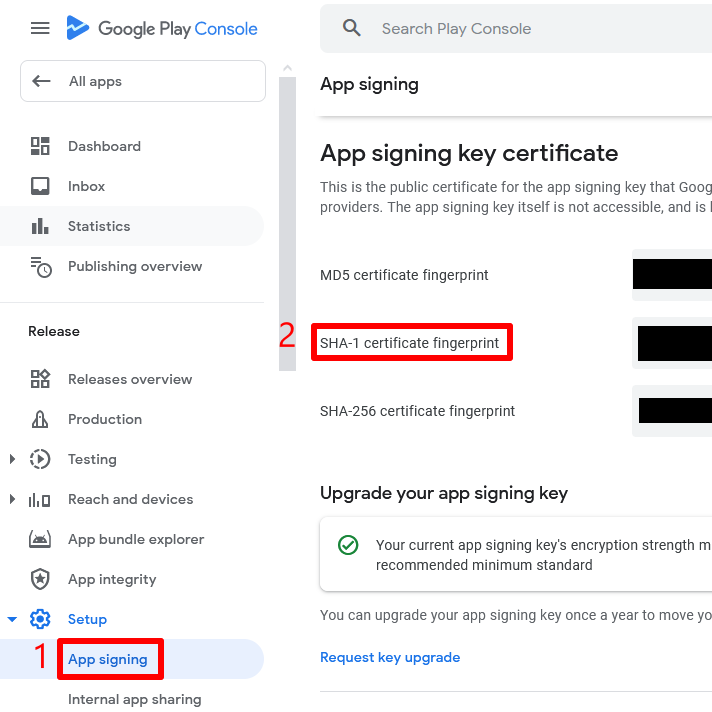

# Godot Play Game Services
Godot 4.3+ plugin for integration of the latest version of [Google Play Game Services SDK](https://developers.google.com/games/services/android/quickstart).

If you want to download the plugin for a previous version of Godot 4.x, use the branch selector in the repository. For Godot 3.x versions, [look here](https://github.com/Iakobs/godot-google-play-game-services-android-plugin)!

---


[](https://developer.android.com)
[](https://github.com/godotengine/godot/)
[](https://developers.google.com/games/services/android/quickstart)

---

## Table of contents
- [Forewords](#forewords)
- [Install the plugin](#install-the-plugin)
- [The Demo project](#the-demo-project)
- [Building the plugin yourself](#building-the-plugin-yourself)
  - [Downloading the plugin](#downloading-the-plugin)
  - [Building the plugin](#building-the-plugin)
  - [Testing the plugin](#testing-the-plugin)
  - [Configuring the plugin](#configuring-the-plugin)
- [Documentation](#documentation)
  - [Kotlin Code](#kotlin-code)
  - [GDScript Code](#gdscript-code)
  - [Google](#google)
- [Troubleshooting](#troubleshooting)
  - [Google Credentials](#google-credentials)
- [Contact me](#contact-me)

## Forewords
The whole project started as a collaboration with [Rafa Laguna](https://github.com/rafalagoon), and this plugin is the updated version of the [old one](https://github.com/Iakobs/godot-google-play-game-services-android-plugin/tree/main) for Godot 3.5+.

With Godot 4.2+, the way android plugins work [has changed](https://docs.godotengine.org/en/stable/tutorials/platform/android/android_plugin.html), so I had to update this plugin to match the new requirements. Now there's only one editor plugin (this one), instead of having two separate plugins like before, one android plugin and one godot plugin.

## Install the plugin
Using the plugin requires downloading the assets in the [releases section](https://github.com/Iakobs/godot-play-game-services/releases) of the repository and following the steps described there to copy the plugin folder to your Godot project.

## The Demo project
There is a Godot Project in the [demo folder](plugin/demo) of the repository. It contains its own documentation on how to use it, so please, take a look if you want to see how I implemented the basic features of this plugin in a real Godot game.

## Building the plugin yourself
If you want to modify something in the code or collaborate, and then you want to try your changes, you can also build the plugin files for yourself.

### Downloading the repository
To download the repository you can use `git` to clone it, or just download the repository in a zip file from GitHub.


### Building the plugin
After making your changes, or if you just want to manually build the plugin, follow these steps. In a terminal window, navigate to the project's root directory and run the following command:
```
./gradlew assemble
```
The output files can be found in [`plugin/demo/addons`](plugin/demo/addons). The plugin itself, that you can copy to your project to use, is in the [`plugin/demo/addons/GodotPlayGameServices`](plugin/demo/addons/GodotPlayGameServices), just copy the whole `GodotPlayGameServices` folder into the `addons` folder of your Godot project and activate the plugin in `Project` -> `Project Settings...` -> `Plugins`

### Testing the plugin
You can also use the included [Godot demo project](plugin/demo) to test the built Android plugin.

- Open the demo in Godot (4.2 or higher)
- Navigate to `Project` -> `Project Settings...` -> `Plugins`, and ensure the plugin is enabled
- Follow the steps on [Configuring the plugin](#configuring-the-plugin)
- Install the Godot Android build template by clicking on `Project` -> `Install Android Build Template...`
- Connect an Android device to your machine and run the demo on it

### Configuring the plugin
Before configuring the plugin, you have to create  a **Google developer account**, which involves a one time payment to google, and then you must create a game. The explanation on how to do all of these is out of the scope of this documentation. Please [refer to Google](https://developer.android.com/distribute/console) for those steps.

Once that's done, you will need to create some achievements and leaderboards in your game, which will generate some IDs. You will need those IDs later in your game, but for the plugin, the one that's important is the **Game ID**, which can be found in your game configuration, in the Google Dev Console:


In order to make the configuration easier, the plugin adds a new dock to the bottom panel of your Godot editor, where you can add the Game ID. Once you click on the submit button, the configuration will be saved and loaded every time you reopen the editor.


> :warning: Beware of not changing the Game Id and submitting by mistake, since that will break the integration with Google Game Services.

### Export configuration
To be able to use the plugin, you need to use a **custom gradle build**. Please note that The steps to do so, are explained with detail in the [Godot Documentation](https://docs.godotengine.org/en/stable/tutorials/export/android_gradle_build.html).

An additional configuration has to be made in order to connect with Google Game Services. In the Google App, you have to configure an **Android OAuth client**. Google describes the steps [here](https://developers.google.com/games/services/console/enabling#step_3_generate_an_oauth_20_client_id), but at some point you have to introduce the **package name** of your game, as well as the **SHA-1 of your signing key**. Both things need to be introduced also in the Godot Export configuration for Android:


## Documentation

### Kotlin Code
You can find the technical documentation of the kotlin code in the [GitHub Pages](https://iakobs.github.io/godot-play-game-services/) of this repository. It's generated with [Dokka](https://kotlinlang.org/docs/dokka-introduction.html) from the [KDocs](https://kotlinlang.org/docs/kotlin-doc.html) documentation on the source code.

### GDScript Code
The GDScript code is documented in the code itself, so you can access it via the Godot Editor. I'm working to publish it in a static webpage too.

### Google
Google provides lots of documentation for integrating with Google Play Game Services, creating an app, etc.

The main page for Game Services is [this one](https://developers.google.com/games/services). There you can find the [Guides](https://developers.google.com/games/services/common/concepts/achievements) section and the [Reference](https://developers.google.com/games/services/reference) section, which contains the technical documentation of their API.

When it comes to Google Play Console, the main page is [here](https://developer.android.com/distribute/console), but the Google Play Game Services documentation also provides a good setup guide [here](https://developers.google.com/games/services/console/enabling).

## Troubleshooting
Here I will add common problems and possible solutions, if any. Thanks to all the people that have opened issues with their problems, so now we can help others in the future to avoid common pitfalls.

### Google Credentials
This is one of the major problems when testing and using the plugin. In order to properly use Google Play Games Services, you have to:
- Create your app of type `game` in your Google Play Console.
- Add and configure the Games Services in your Google Play Console.
  - This involves creating your game assets such as achievements, leaderboards, etc
  - This also, **AND MOST IMPORTANTLY**, includes adding credentials.
- Create the credentials in your Google Cloud and link them in your game in your Google Play Console.
- Make sure that you sign your `.aab` or `.apk` with the correct credentials (in Godot **AND** in the Play Store!)

Creating and linking credentials is a source of confusion, as the process includes many steps. Please refer to the [Google docs](https://developers.google.com/games/services/console/enabling#b_create_a_credential) for further information about creating credentials.

#### Identifying the problem

You will know that your app is failing due to authentication problems, because you will see a message like this in the `adb` logs:

```
**** APP NOT CORRECTLY CONFIGURED TO USE GOOGLE PLAY GAME SERVICES
**** DEVELOPER_ERROR
**** This is usually caused by one of these reasons:
**** (1) Your package name and certificate fingerprint do not match
****     the client ID you registered in Developer Console.
**** (2) Your App ID was incorrectly entered.
**** (3) Your game settings have not been published and you are 
****     trying to log in with an account that is not listed as
****     a test account.
**** (4) A server auth code was requested, but an incorrect client
****     id was provided. The client id for server auth codes should
****     be the client id for the game server (not the android app).
****
**** To help you debug, here is the information about this app
**** Package name         : your.package.name
**** Cert SHA1 fingerprint: AA:AA:11:AA:A1:11:11:11:11:A!:1A:AA:A1:11:1A:A1:1A:A1:11:1A
**** App ID from manifest : 111111111111
****
**** Check that the above information matches your setup in 
**** Developer Console. Also, check that you're logging in with the
**** right account (it should be listed in the Testers section if
**** your project is not yet published).
****
**** For more information, refer to the troubleshooting guide:
****   http://developers.google.com/games/services/android/troubleshooting
****
```

> :warning: This error log can also appear if you have not properly configured the plugin to use your Game id, which is actually in the logs (App ID from manifest). Make sure you followed the [Configuring the plugin](#configuring-the-plugin) steps if you see this error in the logs.

#### Solving the problem

To solve this problem, you have to create an OAuth2 Android Client in your Google Cloud that matches the package name of your game **AND** the `SHA1` certificate of any keystore you are using to sign your app.

You can create as many credentials as you want, so usually my recommendation is to have three credentials:
- One credential for the debug keystore, to use while developing and testing the debug build variant.
- One credential for the release keystore, to use while testing the release build variant.
- One credential with the Play Store certificate, to use when you publish your app to the Play Store.

This is how it looks in Google Cloud (ignore the web auth client autogenerated by Google):


And this is how it looks in the Google Play Console:


The one that causes more problems is the client with the Google Play Store credentials. The process to sign your app and publish it to the Play Store generates a new public certificate that you don't control, and this is the one that many people is missing, and the most important one. To be able to locate the `SHA1` of this certificate, you can see it in the `Release > Setup > App signing` section of your Play Console:



Creating the OAuth2 Client in your Google Cloud and linking it to a new credential in your App in your Google Play Console, will solve the problem, and you will be able to log in from your game.

## Contact me
If you have any questions or want to propose changes, features, or found a bug, please feel free to [open an issue](https://github.com/Iakobs/godot-play-game-services/issues/new).

I try to answer in the same day and provide all the help I can, even if it's out of scope of the plugin, like guiding over some Google configurations, etc.

Please, be kind and respectful when creating issues.
